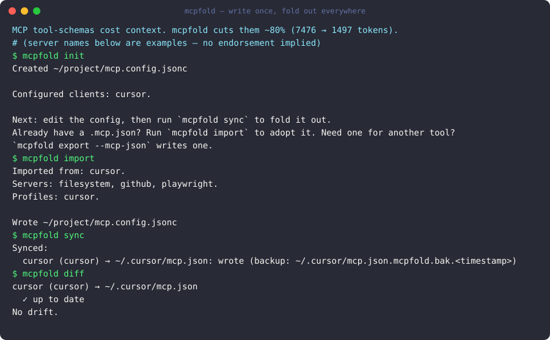

# mcpfold

**Connect every MCP server without paying the context-window tax.** `mcpfold` keeps one
canonical config and folds it out to every client — loading only the tools each agent
actually needs, and resolving secret _references_ instead of hardcoding values.

<p align="center">
  
</p>

<sub>Demo regenerated from the real CLI with `pnpm demo:record` (an [asciinema cast](./demo/mcpfold.cast) + this SVG; a GIF renders in CI via [`demo/mcpfold.tape`](./demo/mcpfold.tape)). Server names shown are examples — no endorsement implied.</sub>

> Status: ground-floor build. The canonical [`mcp.config.jsonc`](./docs/config-format.md)
> format, the local-first CLI wedge, and (later) the cloud sync layer are being built
> story-by-story from [`prd.json`](./prd.json). Full docs live in [`docs/`](./docs/index.md).

## The context-window tax

Every MCP server you connect dumps its full tool schema into your agent's context window
on every turn — used or not. `mcpfold`'s local proxy curates the toolset per client. In a
[reproducible benchmark](./docs/benchmark.md) — github (20 tools), supabase (15),
playwright (10), **45 tools** total — curating down to the **9** actually needed cuts
tool-schema tokens by **~80%** (7,476 → 1,497), with no extra config because the shim
already in the launch path does the filtering.

## …and one config for every client

MCP config sprawls across clients (Claude Code, Cursor, VS Code, Windsurf, Zed, …), and
the formats have quietly diverged: VS Code uses the root key `servers`, Zed uses
`context_servers`, everyone else uses `mcpServers`. Secrets get hardcoded into plaintext
JSON. `mcpfold` keeps one canonical file and folds it out to each client — resolving
secret _references_ (never values) and curating which servers and tools each client loads.
New to it? Start with the [Quickstart](./docs/quickstart.md).

## Monorepo layout

| Package             | Purpose                                                                        |
| ------------------- | ------------------------------------------------------------------------------ |
| `packages/core`     | `@mcpfold/core` — pure, **I/O-free** engine: schema, resolution, drift, diff.  |
| `packages/adapters` | `@mcpfold/adapters` — one module per client (render native ↔ parse canonical). |
| `packages/secrets`  | `@mcpfold/secrets` — env / dotenv / infisical / keychain / 1Password.          |
| `packages/proxy`    | `@mcpfold/proxy` — local MCP proxy for tool-level curation.                    |
| `packages/cli`      | `mcpfold` — the CLI binary (`init`/`import`/`sync`/`diff`/`doctor`/…).         |
| `packages/schema`   | Published JSON Schema for `mcp.config.jsonc`.                                  |
| `apps/web`          | React/TS visual editor + directory (Cloudflare Pages).                         |
| `services/edge`     | Deno Supabase edge functions (auth, push, pull).                               |

**Core purity** is enforced: `packages/core` may not import `node:fs`, `node:os`,
`node:path`, or any network/process library. All I/O is injected through
`ClientAdapter` / `SecretProvider`. Guarded by an ESLint `no-restricted-imports` rule
and the `scripts/check-core-purity.mjs` CI gate.

## Development

Requires **Node 20+** and **pnpm 10+** (`corepack enable`).

```bash
pnpm install          # install workspace deps
pnpm lint             # eslint + core-purity check
pnpm typecheck        # tsc --noEmit across packages
pnpm test             # vitest (unit + fixture snapshots)
pnpm -r build         # build every package
pnpm verify_all       # lint + typecheck + test + build (the full gate)
```

CI runs `verify_all` on a Windows/macOS/Linux × Node 20 matrix — path resolution is
central to this product, so the cross-OS matrix is non-negotiable.

## Editor autocomplete (JSON Schema)

Add a `$schema` line to the top of your `mcp.config.jsonc` for autocomplete and inline
validation in editors that support it:

```jsonc
{
  "$schema": "https://mcpfold.com/schema/v1.json",
  "version": 1,
  // …
}
```

`mcpfold init` writes this line for you. The schema is generated from the zod source
(`packages/schema`) and a CI check fails if the committed
[`mcp.config.schema.json`](./packages/schema/mcp.config.schema.json) drifts from it —
regenerate with `pnpm --filter @mcpfold/schema generate`.

## Pricing, funding & roadmap

The CLI and everything local are **free forever and MIT-licensed**; the hosted cloud is the paid
surface (and you can self-host it yourself for free). See the [pricing model](./docs/pricing-model.md),
the public [roadmap](./docs/roadmap.md), and how the project is run in [governance](./docs/governance.md).

## Support the project

mcpfold's CLI and core are **free forever and MIT-licensed**. If it saves you time, you can help
fund ongoing work:

- **Recurring** — [GitHub Sponsors](https://github.com/sponsors/dj-pearson)
  or [Open Collective](https://opencollective.com/mcpfold)
- **One-time** — [donate via Stripe](https://buy.stripe.com/9B600l5BR6KF1YV01s1Fe00)

Sponsorships fund the free, open-source core. Thank you 🙏

## Autonomous build loop

This project is built story-by-story from [`prd.json`](./prd.json). The loop harness
lives in [`ralph/`](./ralph): [`PROMPT.md`](./ralph/PROMPT.md) is the driver,
[`PROGRESS.md`](./ralph/PROGRESS.md) is the append-only log, and
[`AGENT_NOTES.md`](./ralph/AGENT_NOTES.md) records cross-cutting decisions. Each iteration
picks the highest-priority `todo` story whose dependencies are all `done`, implements it,
runs `verify_all`, and appends a completion line. Run a loop with:

```bash
while :; do claude -p ralph/PROMPT.md || break; done
```

State lives entirely on disk (story `status` in `prd.json` + `PROGRESS.md`), so a fresh
loop resumes without redoing completed work.

## License

MIT for `packages/*` core + CLI. The cloud layer (`apps/web`, `services/edge`) is
commercial/closed. See [`prd.json`](./prd.json) `meta.license`.
